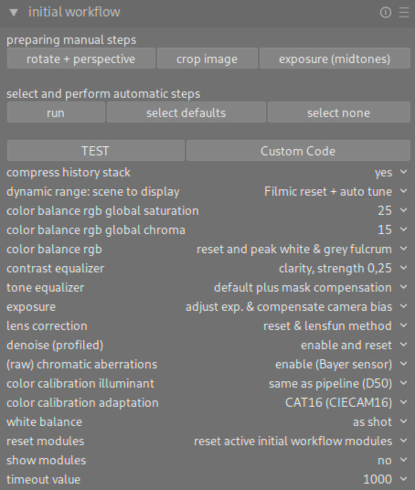
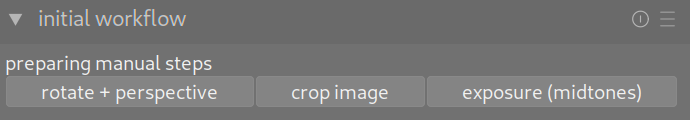
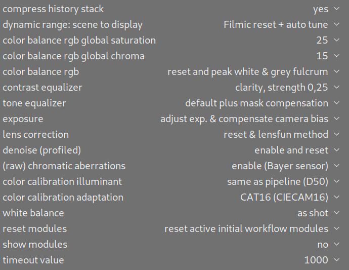
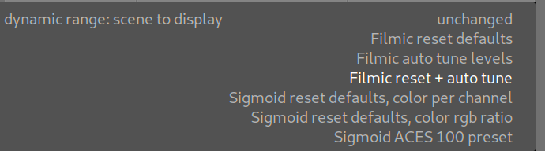
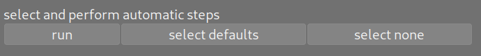

# darktable Initial Workflow Module
This script can be used together with darktable. See https://www.darktable.org/ for more information.

This script offers a new "inital workflow" module both in lighttable and darkroom view. It can be used to do some configuration for an initial image workflow. It calls some automatisms of different modules in the darkroom view, enables your preferred modules and configures some default settings. If this suits your workflow, the script saves some clicks and time.

The new module offers some configuration settings:

In preparation for running the script, use the following buttons to rotate the image, adjust the perspective, crop the image and to adjust the exposure until the mid-tones are clear enough:

After the preparing steps choose your personal configuration for each step:

Each step offers several choices, for example:

Once the configuration is complete, execute the script using the "run" button. The other buttons can be used to select the standard configurations or to deactivate all steps.

## Installation
To install this module, see Darktable documentation for your first steps: https://docs.darktable.org/usermanual/4.2/en/lua/. Require this script from your luarc file and restart darktable. To do this, add the path of this file to .config/darktable/luarc: require "examples/InitialWorkflowModule"

You can execute darktable with additional parameters "darktable -d lua" to get some loggings.

## Workflow Steps
This script executes some automatic functions that can also be accessed via the GUI (e.g. magic wand controls). It provides several workflow steps like "lens correction" or "adapt exposure". If you use it from lighttable view, you can select one or more images. Clicking the run button, selected image(s) are opened in darkroom and all steps are performed as configured. If you use it from darkroom view, the currently opened image is processed.

Several steps are offered, see the tooltips within the module for more information. Your settings are saved in darktable preferences and restored after the next start of the application.

## Add new or modify workflow steps

You can easily customize steps or add new ones. See "IMPLEMENTATION OF WORKFLOW STEPS" within the module file.

All steps are derived from a base class to offer common methods. You can easily customize steps or add new ones: Just copy an existing class and adapt the label, tooltip and function accordingly. Copy and adapt Constructor, Init and Run functions. Don't forget to customize the name of the class as well. Use the new class name for Constructor, Init and Run functions.

By adding it to the "WorkflowSteps" table, the step is automatically displayed and executed. The order in the GUI is the same as the order of declaration here in the code. The order during execution is from bottom to top, along the pixel pipeline.

Using Darktable 4.2 you can get the lua command in this way: Follow https://darktable-org.github.io/dtdocs/en/preferences-settings/shortcuts/ and click on the small icon in the top panel as described in “assigning shortcuts to actions”. You enter visual shortcut mapping mode. Point to a module or GUI control. Within the popup you can read the lua command. The most flexible way is to use the shortcut mapping screen, create and edit a shortcut (action, element and effect), read the lua command from popup windows or copy it to your clipboard (ctrl+v).

Every workflow step contains of constructor, init and run functions. Example:
- StepCompressHistoryStack = WorkflowStepCombobox:new():new {[...]} to create the new instance.
- function StepCompressHistoryStack:Init() to define combobox values and create the widget.
- function StepCompressHistoryStack:Run() to execute the step
- table.insert(WorkflowSteps, StepCompressHistoryStack) to collect all steps and execute some common things.

## Module Tests

Within the script code there is an additional and optional module test implementation. It is used during module development and deployment. There is a special "TEST" button, used to perform module tests. This should be disabled and not visible for general use of the script. To enable it, create a file named "TestFlag.txt" in the same directory as the script file and restart darktable. Up to now, there is a simple module test that iterates over workflow steps and combobox value settings and sets different combinations of module settings. Resulting xmp files are copied to a test result folder. You can compare these files with previously generated reference files.

TestCustomCode.lua: This file contains some custom debug code. This code is executed by clicking the "Custom Code" button. This code can be changed without restarting darktable. You can use it to try some commands "on the fly".
