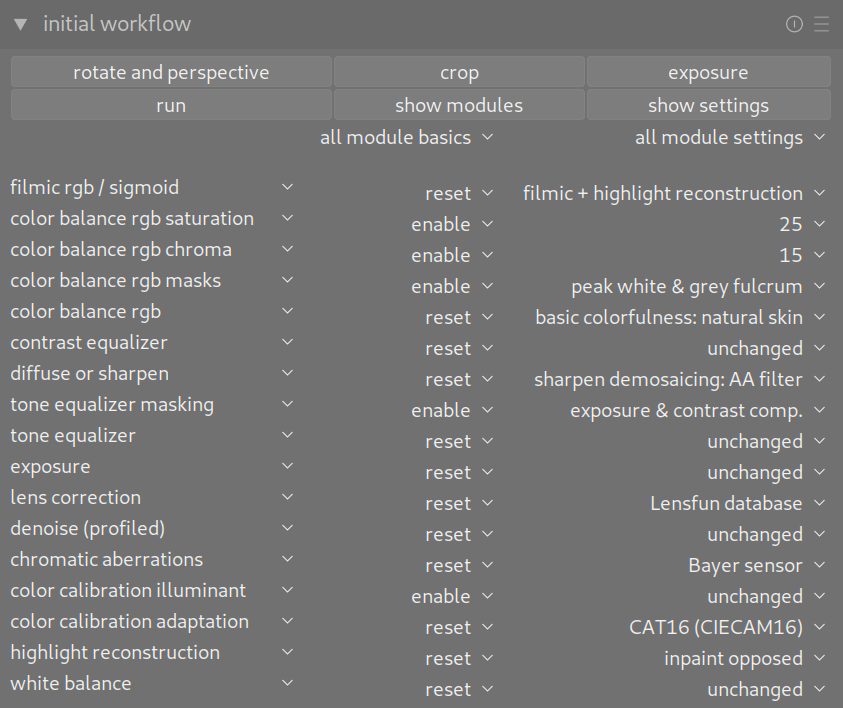
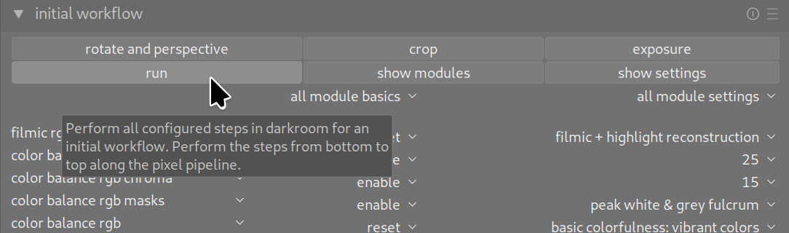

# darktable Initial Workflow Module

## Releases

- you can download the newest release archive from https://github.com/UliGesing/Darktable-Initial-Workflow-Module/releases

## Introduction

- This script can be used together with darktable. See https://www.darktable.org/ for more information.

- Do you use darktable to develop your raw images? Do you often follow the same initial steps for new images? Do you often use the same modules in the darkroom and configure them in the same way before going into the details? Then this script can save you work.

- It offers a new "inital workflow" module both in lighttable and darkroom view. It can be used to do some configuration for an initial image workflow. It calls some automatisms of different modules in the darkroom view, enables your preferred modules and configures some default settings. If this suits your workflow, the script saves some clicks and time.

## Installation and Prerequisites

- This script requires darktable 4.2.1 or 4.4. It can also be used with the development version 4.3. The script was developed and tested on Linux (EndeavourOs). Individual tests were also carried out with Windows 10 (virtual machine).

- You need darktable and Lua installed on your machine. See darktable documentation for your first steps: https://docs.darktable.org/usermanual/4.2/en/lua/. At startup, darktable will automatically run the Lua script called luarc. You can find it here:  

- luarc directory on Linux:   <code>/home/[user_name]/.config/darktable</code>

- luarc directory on Windows:   <code>%LocalAppData%/darktable</code>

### Download Initial-Workflow-Script

- Some examples and contributed scripts come with your darktable lua installation. The initial module script can be installed at the same place.

- Lua script folders on Linux:  <code>/home/[user_name]/.config/darktable/lua/examples</code>

- Lua script folders on Windows:  <code>%LocalAppData%/darktable/lua/examples</code>

- download the newest release archive from https://github.com/UliGesing/Darktable-Initial-Workflow-Module/releases

- extract the script archive and all contained folders to your darktabe lua script example folder:  
<code>[...]/darktable/lua/examples/Darktable-Initial-Workflow-Module/</code>

- after that, you have to integrate it into darktable, using one of the following methods.

### Installation method 1: Using darktable script manager

- edit your luarc file to activate the script manager. The luarc file should contain the following line of code:  <code>require "tools/script_manager"</code>

- restart darktable and use darktable script manager to start the script, see https://docs.darktable.org/lua/stable/lua.scripts.manual/scripts/tools/script_manager/ for details

### Installation method 2: Require from luarc directly

- edit your luarc file to integrate the initial workflow script directly, without using darktable script manager.

- add the path of the script file to your luarc file:  <code>require "examples/Darktable-Initial-Workflow-Module/InitialWorkflowModule"</code>

- restart darktable, the initial workflow script is executed and displayed as a new module

### Installation method 3: Use any other script folder

- you can extract the script archive to any other folder, e.g. your git repository directory

- edit your luarc file to extend the package path and to require the script. Add the following two lines of code and adjust the path name:  <code>package.path = package.path .. ";[any path]/Darktable-Initial-Workflow-Module/?.lua" 
require "InitialWorkflowModule"</code>

- restart darktable, the initial workflow script is executed and displayed as a new module

### Logging

- You can execute darktable with additional parameters <code>darktable -d lua</code> or <code>darktable.exe -d lua</code> to get some loggings.

- This is very helpful to see what is going on during script execution and to identify errors.

- On Windows, logging messages are written to a logfile, see https://www.darktable.org/about/faq/#faq-windows-logs

- On Linux, logging messages are written to your command line

### Localisation

- This script only works if darktable is used with an English or German user interface. The script uses the darktable Lua API to perform the configured settings. Some module presets and other settings are called via their name, as displayed within the darktable user interface. These names are changed, if you configure another language setting. 

- Go to darktable preferences, choose page general and set the interface language to English (en) or German (de).

- Do you want to translate script outputs into your language? Please let me know. Together we can do that. After a short training, it's fairly easy to deal with gettext tools, .po files, .mo files and to upload your translation to the Github repository. You don't have to be a programmer for this, the translation is done in separate text files.

## Usage

### New darktable module

- This script offers a new "inital workflow" module both in lighttable and darkroom view. It executes some automatic functions that can also be accessed via the GUI (e.g. magic wand controls). It provides several workflow steps like "lens correction" or "adapt exposure".

>>

- In preparation for running the script, use the following buttons in darkroom view to rotate the image, adjust the perspective, crop the image and to adjust the exposure until the mid-tones are clear enough: 
>>

### Configuration

- After the preparing steps choose your personal configuration for each step. Several steps and configurations are offered, see the tooltips within the module for more information. Your settings are saved in darktable preferences and restored after the next start of the application. 
>>

- Each step offers several choices, for example: 
>>

### Execution

- Once the configuration is complete, execute the script using the "run" button. The other buttons can be used to select the standard configurations or to deactivate all steps. If you use it from lighttable view, you can select one or more images. Clicking the run button, selected image(s) are opened in darkroom and all steps are performed as configured. If you use it from darkroom view, the currently opened image is processed. 
>>

- Do you want to know more about what the individual steps of the workflow change? Deactivate all steps via the "select none" button. Then activate "show modules". Then activate the step that interests you and select one of the settings. With "run" only this one configuration is executed and the affected module is displayed. This way you will see the changes made.

>>

### Timeouts

- Some calculations take a certain amount of time. Depending on the hardware equipment also longer. This script waits and attempts to detect timeouts.If steps take much longer than expected, those steps will be aborted.

- You can configure the default timeout (ms). Before and after each step of the workflow, the script waits this time. In other places also a multiple (loading an image) or a fraction (querying a status). 

- 

## Request for Change

### Transmit your requirements

- Do you have any suggestions for further steps or options? Which darkroom modules do you use most often? With which settings does your own workflow start?

- Just let me know or see the description below how to do it yourself.

### Add new or modify workflow steps

- You can easily customize steps or add new ones. See "IMPLEMENTATION OF WORKFLOW STEPS" within the module file.

- All steps are derived from a base class to offer common methods. You can easily customize steps or add new ones: Just copy an existing class and adapt the label, tooltip and function accordingly. Copy and adapt Constructor, Init and Run functions. Don't forget to customize the name of the class as well. Use the new class name for Constructor, Init and Run functions.

- By adding it to the "WorkflowSteps" table, the step is automatically displayed and executed. The order in the GUI is the same as the order of declaration here in the code. The order during execution is from bottom to top, along the pixel pipeline.

- Using Darktable 4.2 you can get the lua command in this way: Follow https://darktable-org.github.io/dtdocs/en/preferences-settings/shortcuts/ and click on the small icon in the top panel as described in “assigning shortcuts to actions”. You enter visual shortcut mapping mode. Point to a module or GUI control. Within the popup you can read the lua command. The most flexible way is to use the shortcut mapping screen, create and edit a shortcut (action, element and effect), read the lua command from popup windows or copy it to your clipboard (ctrl+v).

- Every workflow step contains of constructor, init and run functions. Example:  <code>StepCompressHistoryStack = WorkflowStepCombobox:new():new {[...]}</code> to create the new instance.  <code>function StepCompressHistoryStack:Init()</code> to define combobox values and create the widget.  <code>function StepCompressHistoryStack:Run()</code> to execute the step  <code>table.insert(WorkflowSteps, StepCompressHistoryStack)</code> to collect all steps and execute some common things.

### Module Tests

- The git repository provides some files to execute module tests. This is used during module development and deployment. Within the script code there is an additional and optional module test implementation. This should be disabled and not visible for general use of the script. To run these tests, do the following steps:  
- create a file named "TestFlag.txt" in the same directory as the script file and restart darktable
- from now there is a special "TEST" button, used to perform the module tests
- open any image in darkroom view, create a backup first
- create a new folder named "TEST" on your harddisk below the folder of this image file
- click the TEST button to start the tests
- up to now, there is a simple module test that iterates over workflow steps and combobox value settings
- it creates some images and sets different combinations of module settings
- resulting xmp files are copied to the TEST result folder
- you can compare these files with previously generated reference files
- after tests are completed, there should be no error messages

### TestCustomCode.lua

The git repository contains one additional file called TestCustomCode.lua.
- do you want to run some special tests?
- do you want to execute some dt.gui.action commands?
- this file contains some custom debug code
- this code is executed by clicking the "Custom Code" button
- it can be changed without restarting darktable
- you can use it to try some commands "on the fly".
